# FinResearch AI - Advanced Track

**Multi-Agent Financial Research System**

A production-grade, hierarchical multi-agent system for automated financial research, built with CrewAI. This implementation serves as the gold standard reference for the FinResearch AI project.

---

## System Architecture

```mermaid
flowchart TB
    subgraph Input
        CLI[("📟 CLI\nmain.py")]
        ENV[("⚙️ Config\n.env + YAML")]
    end

    subgraph Orchestration
        CREW["🎯 FinResearchCrew\nsrc/crew.py"]
        MGR["👔 Manager Agent\nOrchestrates workflow"]
    end

    subgraph Workers
        RES["🔍 Researcher\nQualitative analysis"]
        ANA["📊 Analyst\nQuantitative analysis"]
        REP["📝 Reporter\nReport synthesis"]
    end

    subgraph Tools
        NEWS["📰 NewsSearchTool\nDuckDuckGo"]
        FIN["💹 FinancialDataTool\nYahoo Finance"]
        MEM["🧠 MemoryTool\nChromaDB"]
    end

    subgraph Output
        REPORT[("📄 Markdown Report\n./reports/")]
    end

    CLI --> CREW
    ENV --> CREW
    CREW --> MGR
    MGR -->|delegates| RES
    MGR -->|delegates| ANA
    MGR -->|coordinates| REP
    
    RES --> NEWS
    RES --> MEM
    ANA --> FIN
    ANA --> MEM
    REP --> MEM
    
    REP --> REPORT
```



---

## Directory Structure

```
yan-cotta/
├── main.py                 # CLI entry point
├── README.md               # This documentation
├── week2_agents.py         # Educational demo (Week 2)
│
└── src/
    ├── __init__.py
    ├── crew.py             # Crew orchestration logic
    │
    ├── config/
    │   ├── __init__.py
    │   ├── settings.py     # Pydantic settings management
    │   ├── agents.yaml     # Agent personas & prompts
    │   └── tasks.yaml      # Task templates
    │
    ├── agents/
    │   ├── __init__.py
    │   ├── base.py         # Base factory & utilities
    │   ├── manager.py      # Manager agent (orchestrator)
    │   ├── researcher.py   # Researcher agent (qualitative)
    │   ├── analyst.py      # Analyst agent (quantitative)
    │   └── reporter.py     # Reporter agent (synthesis)
    │
    └── tools/
        ├── __init__.py
        ├── base.py         # Base tool classes
        ├── financial_data.py   # Yahoo Finance wrapper
        ├── news_search.py      # DuckDuckGo wrapper
        └── memory.py           # ChromaDB memory tool
```

---

## Module Overview

### `src/config/`
**Configuration Management**

| File | Purpose |
|------|---------|
| `settings.py` | Pydantic-based settings with environment variable support |
| `agents.yaml` | Agent roles, goals, and backstories (prompts) |
| `tasks.yaml` | Task description templates with placeholders |

### `src/tools/`
**External Service Wrappers**

| Tool | Data Source | Purpose |
|------|-------------|---------|
| `FinancialDataTool` | Yahoo Finance | Stock prices, valuation metrics, fundamentals |
| `NewsSearchTool` | DuckDuckGo | News articles with source verification |
| `MemoryTool` | ChromaDB | Persistent vector memory for agent collaboration |

### `src/agents/`
**Specialized Agent Factories**

| Agent | Role | Temperature | Tools |
|-------|------|-------------|-------|
| **Manager** | Orchestration & delegation | 0.1 | Memory |
| **Researcher** | Qualitative analysis | 0.7 | News, Memory |
| **Analyst** | Quantitative analysis | 0.0 | Financial, Memory |
| **Reporter** | Report synthesis | 0.5 | Memory |

### `src/crew.py`
**Crew Orchestration**

Provides two execution modes:
- `FinResearchCrew`: Hierarchical process with Manager delegation
- `SequentialFinResearchCrew`: Linear task execution (for debugging)

---

## Setup Instructions

### 1. Prerequisites

- Python 3.10+
- OpenAI API key

### 2. Installation

```bash
# Navigate to this directory
cd advanced/submissions/team-members/yan-cotta

# Create virtual environment
python -m venv venv
source venv/bin/activate  # Linux/Mac
# or: venv\Scripts\activate  # Windows

# Install dependencies
pip install -r requirements.txt
```

### 3. Dependencies

Create `requirements.txt`:
```
crewai>=0.51.0
crewai-tools>=0.8.0
langchain-openai>=0.1.0
yfinance>=0.2.36
duckduckgo-search>=4.0.0
chromadb>=0.4.22
pydantic>=2.0.0
pydantic-settings>=2.0.0
python-dotenv>=1.0.0
pyyaml>=6.0.0
```

### 4. Configuration

Create a `.env` file in the project root:

```env
# Required
OPENAI_API_KEY=sk-your-openai-api-key

# Optional overrides
FINRESEARCH_MANAGER_MODEL=gpt-4o-mini
FINRESEARCH_WORKER_MODEL=gpt-3.5-turbo
FINRESEARCH_LOG_LEVEL=INFO
FINRESEARCH_OUTPUT_DIR=./reports
```

---

## Usage

### Basic Research

```bash
# Research Apple Inc
python main.py AAPL

# Research with company name
python main.py TSLA --name "Tesla Inc"

# Use sequential process (simpler, for debugging)
python main.py MSFT --sequential

# Custom output filename
python main.py GOOGL --output google_research.md

# Verbose mode (see agent reasoning)
python main.py NVDA --verbose
```

### CLI Options

```
positional arguments:
  ticker                Stock ticker symbol (e.g., AAPL, TSLA)

optional arguments:
  -n, --name            Company name (defaults to ticker)
  -o, --output          Output filename for report
  -s, --sequential      Use sequential instead of hierarchical process
  -v, --verbose         Enable verbose agent output
  -q, --quiet           Suppress banner and progress
  --log-level           Logging level (DEBUG/INFO/WARNING/ERROR)
  --log-file            Log to file instead of stdout
  --dry-run             Validate config without running
```

### Python API

```python
from src.crew import FinResearchCrew

# Create and run crew
crew = FinResearchCrew(
    ticker="AAPL",
    company_name="Apple Inc",
    verbose=True
)

# Execute research
report = crew.run()

# Save report
path = crew.save_report(report)
print(f"Report saved to: {path}")
```

---

## Workflow


---

## Output Example

Reports are saved to `./reports/` with the format:
```
report_AAPL_20241212_143052.md
```

Sample report structure:
```markdown
# Investment Research Report: Apple Inc (AAPL)

**Generated:** 2024-12-12 14:30:52 UTC

## Executive Summary
...

## Recent Developments
...

## Financial Analysis
...

## Investment Considerations
...

## Risk Factors
...

## Disclaimer
This report is for informational purposes only...
```

---

## Design Decisions

### Why Hierarchical Process?
The Manager agent coordinates work, ensuring:
- Proper task sequencing
- Quality control before final output
- Efficient delegation to specialists

### Why Separate Tools per Agent?
- **Prevents hallucination**: Analyst can't make up news
- **Clear responsibilities**: Each agent has focused expertise
- **Easier debugging**: Issues are isolated to specific agents

### Why ChromaDB Memory?
- Enables agent collaboration without direct communication
- Persists context across task boundaries
- Supports semantic retrieval for relevant information

---

## Troubleshooting

### "OPENAI_API_KEY not configured"
Ensure your `.env` file is in the project root and contains a valid key.

### "No data found for ticker"
Verify the ticker symbol is valid on Yahoo Finance.

### "ChromaDB not installed"
Run: `pip install chromadb`

### Agent seems stuck
Use `--sequential` mode for simpler execution and easier debugging.

---

## License

MIT License - See project root for details.

---

**Author:** Yan Cotta  
**Version:** 1.0.0  
**Last Updated:** December 2024
